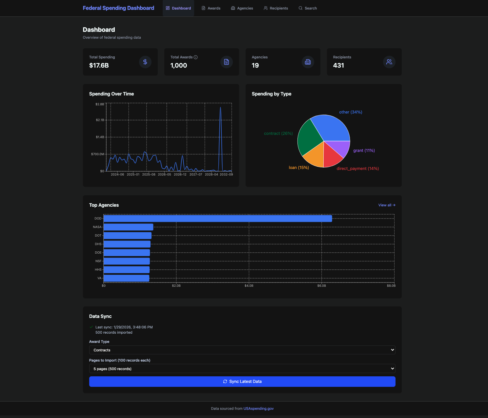

# Federal Spending Dashboard

A full-stack application for exploring federal spending data from USAspending.gov.



## Features

- **Real-time Data Sync** - Pull latest contracts, grants, loans, and direct payments from USAspending.gov
- **Full-text Search** - Elasticsearch-powered search with autocomplete
- **Interactive Charts** - Spending over time, by agency, by type
- **Sortable Tables** - Click column headers to sort
- **Detail Pages** - Drill down into agencies and recipients

## Tech Stack

**Backend:** Ruby on Rails 8, PostgreSQL, Elasticsearch, Sidekiq

**Frontend:** React 18, Vite, Recharts, Tailwind CSS

## Quick Start

### Prerequisites

- Docker Desktop
- Ruby 3.2+
- Node.js 18+

### Setup

Clone the repo and run the setup script:

    git clone https://github.com/camorford/federal-spending-dashboard
    cd federal-spending-dashboard
    ./setup.sh

### Run

Start all services:

    ./start.sh

Open http://localhost:5173

## Architecture
```
federal-spending-dashboard/
├── backend/                # Rails API
│   ├── app/
│   │   ├── controllers/    # API endpoints
│   │   ├── models/         # Award, Agency, Recipient, SyncLog
│   │   └── services/       # USAspending API client, importer
│   └── config/
├── frontend/               # React app
│   ├── src/
│   │   ├── components/     # Layout, StatCard, SyncPanel
│   │   ├── pages/          # Dashboard, Awards, Agencies, Recipients
│   │   └── services/       # API client
│   └── vite.config.js
├── docker-compose.yml      # PostgreSQL, Redis, Elasticsearch
├── setup.sh                # One-command setup
└── start.sh                # One-command start
```

## API Endpoints

| Endpoint | Description |
|----------|-------------|
| `GET /api/v1/awards` | List awards (filterable, sortable) |
| `GET /api/v1/agencies` | List agencies |
| `GET /api/v1/agencies/:id` | Agency details with stats |
| `GET /api/v1/recipients` | List recipients |
| `GET /api/v1/recipients/:id` | Recipient details |
| `GET /api/v1/search?q=` | Full-text search |
| `GET /api/v1/stats/overview` | Dashboard stats |
| `POST /api/v1/sync/start` | Trigger data sync |

## Data Model

- **Agency** - Federal agencies (DOD, NASA, HHS, etc.)
- **Recipient** - Organizations receiving funding
- **Award** - Individual spending records (contracts, grants, loans, direct payments)
- **SyncLog** - Tracks data import history

## License

MIT